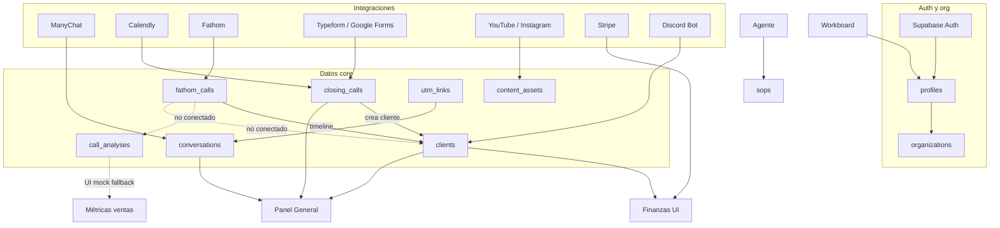

# AI COO Platform — Estado del proyecto (Phase 2 planning)

Documento de referencia generado desde el código en `ai-coo-platform`. Solo hechos del repositorio; sin opiniones.

**Última revisión:** 2026-05-27  
**Branch de referencia:** `main` (post `fix(clients): show calls tab always with empty state for real clients`)

---

## 1. Stack y arquitectura

### Stack completo

| Capa | Tecnología |
|------|------------|
| **Monorepo** | pnpm workspaces + Turborepo |
| **Frontend** | Next.js 15 (App Router), React 19, TypeScript 5.8 |
| **Estilos** | Tailwind CSS 3.4, tokens en `packages/ui` |
| **UI** | `@ai-coo/ui` (Radix primitives, CVA, glassmorphism en componentes flotantes) |
| **Gráficos** | visx + d3 (`apps/web/components/charts/`) |
| **Animación** | Framer Motion / Motion |
| **Backend app** | Next.js Server Actions + Route Handlers (`app/api/`) |
| **Base de datos** | Supabase (PostgreSQL + Auth + RLS) |
| **Auth** | Supabase Auth (email), bootstrap org/profile en primer login |
| **IA** | Anthropic SDK (`@anthropic-ai/sdk`), modelos Haiku/Sonnet vía `lib/ai/anthropic.ts` |
| **Email** | Resend |
| **Cron** | Vercel Cron (`apps/web/vercel.json`) |
| **Bot Discord** | App separada `apps/discord-bot` (discord.js + Supabase service role) |
| **Deploy** | Vercel (web), proceso Discord aparte |
| **Paquetes reservados** | `@ai-coo/queue`, `@ai-coo/ai`, `@ai-coo/database`, `@ai-coo/integrations` — stubs Phase 2 |

### Estructura de carpetas principal

```
ai-coo-platform/
├── apps/
│   ├── web/                    # App principal Next.js
│   │   ├── app/                # Rutas (platform), API, server actions
│   │   ├── components/         # UI por dominio
│   │   ├── layouts/            # Shell (three-column-layout, sidebar)
│   │   ├── lib/                # Lógica de negocio, integraciones, IA, métricas
│   │   ├── mocks/              # Datos demo Phase 0/1
│   │   ├── providers/          # React context (platform, finance, marketing)
│   │   ├── routes/             # paths.ts, navigation.ts
│   │   └── types/              # Tipos TS del dominio web
│   └── discord-bot/            # Bot de ingestión Discord → Supabase
├── packages/
│   ├── ui/                     # Design system compartido
│   ├── types/                  # Tipos compartidos (@ai-coo/types)
│   ├── config/                 # ESLint, TS, Tailwind preset
│   ├── ai/                     # Reservado Phase 2
│   ├── queue/                  # Reservado Phase 2 (BullMQ)
│   ├── database/               # Reservado
│   └── integrations/           # Reservado
└── supabase/
    └── migrations/             # 28 migraciones SQL (+ RUN_ALL_PHASE1.sql duplicado)
```

### Patrones arquitecturales

| Patrón | Uso |
|--------|-----|
| **Server Actions** | `app/*/actions.ts` — CRUD y lecturas con `createClient()` + `requireOrganizationId()` |
| **Service role admin** | `lib/supabase/admin.ts` — webhooks, cron, integraciones, escritura cross-tenant |
| **Providers cliente** | `PlatformDataProvider`, `FinanceDataProvider`, `MarketingDataProvider` — estado global + refresh |
| **Mapper row ↔ domain** | `lib/*/mapper.ts` — snake_case DB → camelCase TS |
| **Derivación de métricas** | `lib/metrics/*` — agregaciones en cliente desde datos reales |
| **Fallback mock** | `isSupabaseConfigured()` → si false, mocks; si true pero tablas vacías, seed/fallback en varios módulos |
| **Multi-tenant** | `organization_id` en tablas + RLS `get_my_organization_id()` |
| **Integraciones** | OAuth/API key → tabla `*_integrations` → cron/webhook → tablas de dominio |
| **IA síncrona** | `callClaudeJson` / `callClaudeText` en server con tracking en `token_usage` |

### Gate de datos: `isSupabaseConfigured()`

Definido en `apps/web/lib/supabase/env.ts`. Requiere `NEXT_PUBLIC_SUPABASE_URL` + (`NEXT_PUBLIC_SUPABASE_ANON_KEY` o `NEXT_PUBLIC_SUPABASE_PUBLISHABLE_KEY`). Si no está configurado, la app opera en modo demo con mocks.

---

## 2. Base de datos — estado actual

**Total: 44 tablas** en migraciones (excl. duplicados de `RUN_ALL_PHASE1.sql`).

Leyenda **Estado de uso**:
- **Real** — lectura/escritura en flujos de producción con Supabase configurado
- **Mock** — UI usa mocks; tabla no alimenta la pantalla o no se escribe
- **Vacía** — tabla existe; típicamente sin datos o sin UI conectada
- **Mixto** — real con fallback/seed mock

### Tablas core

| Tabla | Campos principales | RLS | Estado uso |
|-------|-------------------|-----|------------|
| `organizations` | id, name, status, website_url, timestamps | Sí | **Real** — bootstrap, settings |
| `profiles` | id→auth.users, organization_id, email, full_name, role, avatar_url | Sí | **Real** — auth, workboard assignees |
| `onboarding_responses` | organization_id (unique), data jsonb, completed_at | Sí | **Real** — wizard onboarding |
| `clients` | datos pago/estado, installments jsonb, sales_fathom_url, linked_calls jsonb, ai_insights | Sí | **Real** — lista/detalle; `linked_calls` casi siempre `[]` en prod |
| `closing_calls` | lead, scheduled_at, status, conversation_id, form_answers, fathom_url, outcome, payment IDs | Sí | **Real** — módulo Closing; seed mock si vacío |
| `conversations` | lead_name, status, tag, messages jsonb, analysis jsonb, external_ref | Sí | **Real** — inbox ManyChat; seed mock si vacío sin ManyChat |

### Integraciones (credenciales + datos)

| Tabla | Campos principales | RLS | Estado uso |
|-------|-------------------|-----|------------|
| `calendly_integrations` | tokens OAuth, webhook URIs, signing key | Sí (sin SELECT cliente) | **Real** si conectado |
| `manychat_integrations` | api_token, page_id, webhook_token | Sí (sin SELECT cliente) | **Real** si conectado |
| `fathom_integrations` | api_key, webhook_secret, status | Sí (sin SELECT cliente) | **Real** si conectado |
| `youtube_integrations` | tokens OAuth, channel metadata | Sí (sin SELECT cliente) | **Real** si conectado |
| `typeform_integrations` | tokens OAuth | Sí (sin SELECT cliente) | **Real** si conectado |
| `google_forms_integrations` | tokens OAuth (unificado con Google) | Sí (sin SELECT cliente) | **Real** si conectado |
| `instagram_integrations` | access_token, instagram_user_id, page_id | Sí (sin policies → service role) | **Real** si conectado |
| `stripe_integrations` | stripe_account_id, access_token | Sí (sin policies → service role) | **Real** si conectado |
| `discord_integrations` | guild_id, monitored_channels, status | Sí | **Real** si bot conectado |

### Fathom y clientes

| Tabla | Campos principales | RLS | Estado uso |
|-------|-------------------|-----|------------|
| `fathom_calls` | fathom_call_id, transcript, summary, status, client_id, AI fields (situation_summary, next_steps, problems), fathom_url | Sí (SELECT org) | **Real** — pipeline Fathom; no alimenta `clients.linked_calls` |
| `client_timeline_entries` | client_id, fathom_call_id, situation_summary, next_steps, progress_indicator | Sí (SELECT org) | **Real** — timeline en ficha cliente |
| `client_problems` | problem_description, detected_from, source_id, status | Sí (SELECT org) | **Real** — escrito desde process Fathom |
| `sales_scripts` | name, is_active, sections jsonb | Sí | **Vacía** — sin UI ni escritura |
| `call_analyses` | scores, section_scores, objections, power_phrases, closer_name, booked, sold | Sí | **Vacía** — sin pipeline que escriba; UI usa mocks |

### Marketing y forms

| Tabla | Campos principales | RLS | Estado uso |
|-------|-------------------|-----|------------|
| `content_assets` | platform, external_id, métricas, AI labels, effective_label | Sí | **Mixto** — real si sync YouTube/Instagram; fallback mock en UI si vacío |
| `forms` | platform, external_form_id, title, questions, AI insights | Sí | **Real** si Typeform/Google conectados |
| `form_responses` | answers jsonb, lead_score, qualification | Sí | **Real** — scoring IA en sync |
| `utm_links` | utm params, contadores clicks/leads/bookings/sales | Sí | **Real** — generador UTMs |
| `utm_lead_captures` | lead_email, utm_link_id, conversion flags | Sí (SELECT org; escritura service role) | **Real** — API `/api/utm/track` |

### Finanzas

| Tabla | Campos principales | RLS | Estado uso |
|-------|-------------------|-----|------------|
| `payment_platforms` | name, slug, currency | Sí | **Real** — seed desde mock si vacío |
| `fixed_expenses` | name, category, amount, frequency | Sí | **Real** |
| `subscriptions` | name, amount, billing_cycle | Sí | **Real** |
| `team_compensation` | member_id, salarios, comisiones | Sí | **Real** |

### Agente, workboard, SOPs

| Tabla | Campos principales | RLS | Estado uso |
|-------|-------------------|-----|------------|
| `agent_projects` | name, description, color | Sí | **Real** |
| `business_stages` | name, order_index, is_active | Sí | **Real** |
| `agent_conversations` | project_id, stage_id, title | Sí | **Real** |
| `agent_messages` | role, content, attachments, action_type | Sí | **Real** — IA si `ANTHROPIC_API_KEY` |
| `sops` | title, department, content, goal, status | Sí | **Mixto** — real o `mocks/sops.ts` |
| `workboard_tasks` | status, area, priority, assignee_id, due_date, position | Sí | **Real** |

### Discord

| Tabla | Campos principales | RLS | Estado uso |
|-------|-------------------|-----|------------|
| `discord_client_links` | client_id, discord_user_id, link_method | Sí | **Real** con bot activo |
| `discord_messages` | content, sentiment flags, client_id | Sí | **Real** con bot activo |
| `discord_pending_channels` | channel_id, status | Sí | **Real** |
| `discord_pending_links` | discord user, email_attempted, status | Sí | **Real** |

### Super Admin

| Tabla | Campos principales | RLS | Estado uso |
|-------|-------------------|-----|------------|
| `super_admin_users` | email, role | Sí (sin policies) | **Real** — service role |
| `token_usage` | organization_id, model, tokens, cost, feature | Sí | **Real** — tracking IA |
| `ai_brain_documents` | title, category, content, file_url, tags | Sí (sin policies) | **Real** — super-admin AI brain |
| `organization_notes` | organization_id, note | Sí | **Real** |
| `waitlist_leads` | email, source, utm columns | Sí (deny-all client) | **Real** — landing waitlist |

### Migraciones solo ALTER (sin tablas nuevas)

`20260521200000_fix_rls_recursion.sql`, `20260521510000_closing_conversation_fk.sql`, `20260521600000_calendly_sync_closing_calls.sql`, `20260522200000_marketing_content_fields.sql`, `20260522400000_profiles_avatar_url.sql`, `20260605100000_fathom_api_key.sql`, `20260606100000_security_hardening_rls.sql`, `20260607100000_fathom_calls_org_call_unique.sql`, `20260613200000_utm_manychat.sql`, `20260613300000_org_website_url.sql`

---

## 3. Módulos del software — estado por módulo

### Panel General (`/dashboard`)

| Aspecto | Estado |
|---------|--------|
| **UI** | Completa — resumen ejecutivo, riesgos, oportunidades, métricas revenue/ventas/ops, recomendaciones |
| **Datos** | **Mixto** — sin Supabase: `mocks/dashboard.ts`. Con Supabase: `deriveDashboardData()` desde clientes + conversaciones + closing + finanzas |
| **Integraciones** | Indirectas (clientes, ventas, finanzas) |
| **Falta para 100% real** | Métricas ops desde workboard/inputs reales; narrativa IA enriquecida; churn calculado (hoy `"—"`); eliminar dependencia de heurísticas mock en secciones ops |

### Tablero de trabajo (`/workboard`)

| Aspecto | Estado |
|---------|--------|
| **UI** | Parcial — Kanban + detalle de tarea real; sprints y “tiempo por persona” decorativos |
| **Datos** | **Mixto** — tareas: `workboard_tasks` (Supabase). Sprints: `mocks/workboard-sprints.ts`. Tiempo: `mocks/workboard-time.ts` |
| **Integraciones** | Ninguna directa |
| **Falta** | Persistir sprints/objetivos; time tracking real; requiere Supabase (sin fallback mock en página) |

### Agente de negocio (`/agent`)

| Aspecto | Estado |
|---------|--------|
| **UI** | Completa — proyectos, etapas, conversaciones, chat |
| **Datos** | **Real** — `agent_projects`, `business_stages`, `agent_conversations`, `agent_messages` |
| **Integraciones** | Anthropic API (`ANTHROPIC_API_KEY`); sin key → respuesta mock fija |
| **Falta** | Contexto org/SOPs/RAG; paquete `@ai-coo/ai`; routing multi-modelo; acciones del agente sobre otros módulos |

### Clientes (`/clients`, `/clients/[id]`, `/clients/pending-calls`)

| Aspecto | Estado |
|---------|--------|
| **UI** | Parcial-completa — lista, detalle, pagos, timeline Fathom, sección Llamadas (siempre visible), Discord activity |
| **Datos** | **Mixto** — CRUD: `clients` (Supabase). Sin Supabase: `mocks/clients.ts`. Timeline: `client_timeline_entries` (real). Llamadas en detalle: `clients.linked_calls` jsonb (casi vacío en prod). Análisis profundo: solo mock embebido en JSON |
| **Integraciones** | Fathom (calls, timeline, pending-calls). Discord (activity). Closing crea cliente con `linkedCalls` metadata sin `analysis` |
| **Falta** | Pipeline Fathom → `linked_calls` + `call_analyses`; análisis profundo en UI para datos reales; `aiInsights` sigue mock; vincular `getCallAnalysesAction` al detalle |

### Base de conocimiento (`/business-context/documents`, `/business-context/[id]`)

| Aspecto | Estado |
|---------|--------|
| **UI** | Parcial — grid documentos, viewer, tareas sugeridas, modal añadir |
| **Datos** | **Mixto** — documentos: `mocks/business-context.ts`. Calls Fathom en KB: query real. Tareas sugeridas: `mocks/suggested-call-tasks.ts`. Viewer `[id]`: 100% mock |
| **Integraciones** | Fathom (listado calls para KB) |
| **Falta** | Upload/indexación real; pgvector/RAG; persistencia documentos; viewer con contenido real |

### Integraciones (`/integrations`, `/integrations/discord`)

| Aspecto | Estado |
|---------|--------|
| **UI** | Completa — grid, connect/disconnect, sync manual, subpágina Discord |
| **Datos** | **Mixto** — catálogo base `mocks/integrations.ts`; estado/conteos reales para 9 proveedores vía `integrations/actions.ts` |
| **Integraciones** | ManyChat, Calendly, Fathom, YouTube, Typeform, Google Forms, Instagram, Stripe, Discord — ver sección 4 |
| **Falta** | Proveedores del catálogo sin implementación (Notion, Google Sheets, etc.); algunos “Gestionar” con toast “próximamente” |

### Equipo (`/team`)

| Aspecto | Estado |
|---------|--------|
| **UI** | Parcial — tabla miembros, formulario roles custom en memoria |
| **Datos** | **Mock** — `mocks/team.ts` hardcoded. Roles custom: estado React en `PlatformDataProvider`, sin persistencia |
| **Integraciones** | Ninguna |
| **Falta** | Cargar `profiles` de la org; CRUD miembros; persistir roles; invitaciones |

### Marketing (`/marketing/*`)

| Subruta | UI | Datos | Falta |
|---------|-----|-------|-------|
| Overview | Parcial-completa | Distribución contenido real; charts/funnel mock | Funnel real contenido→ventas |
| Contenido | Completa | `content_assets` real; fallback `mocks/marketing-content.ts` | Detalle `[id]` usa `mocks/marketing-insights` |
| Conexión ventas | Completa visual | 100% `mocks/marketing.ts` | Correlación real |
| Formularios | Completa | `forms` + `form_responses` (Supabase) | Depende integraciones |
| UTMs (`/marketing/utms`) | Completa | `utm_links` real; fallback `mocks/utm-links.ts`; leads sheet parcial mock | UI leads 100% conectada a `utm_lead_captures` |

### Ventas (`/sales/inbox`, `/sales/metrics`, `/sales/closing`)

| Subruta | UI | Datos | Falta |
|---------|-----|-------|-------|
| Bandeja | Completa | `conversations` (Supabase/ManyChat); journey inline mock | Lead journey real desde UTMs/contenido |
| Métricas | Completa | Métricas derivadas reales; `frequentObjections` siempre mock; ranking calls con fallback mock | Objeciones IA Phase 2; `call_analyses` real |
| Closing | Completa | `closing_calls` real; seed mock si vacío | — |

### Producto (`/product/*`)

| Aspecto | Estado |
|---------|--------|
| **UI** | Completa visual — vista espacial, avatares, value ladder, ofertas |
| **Datos** | **Mock** — `mocks/product.ts`, badge “Mock · Phase 2” |
| **Integraciones** | Ninguna |
| **Falta** | Tablas + CRUD; alimentar Agente de negocio |

### Lanzamientos (`/lanzamientos`)

| Aspecto | Estado |
|---------|--------|
| **UI** | **Placeholder** — pantalla “Próximamente” |
| **Datos** | Ninguno |
| **Falta** | Módulo completo |

### Operaciones (`/operations/*`)

| Subruta | UI | Datos | Falta |
|---------|-----|-------|-------|
| Overview | Completa visual | `mocks/operations-overview.ts` | Reportes reales |
| Inputs semanales | Parcial | Estado local React | Persistencia + actions |
| SOPs | Parcial-completa | `sops` Supabase o `mocks/sops.ts` | Generación IA SOPs real |
| Team inputs | Completa visual | `mocks/operations.ts` | Backend |

### Finanzas (`/finance`, `/finance/expenses`)

| Aspecto | Estado |
|---------|--------|
| **UI** | Completa — overview, Stripe, plataformas, gastos |
| **Datos** | **Mixto** — gastos/plataformas: Supabase (`finance/actions.ts`), seed mock si vacío. Revenue derivado de clientes reales. Sin Supabase: `mocks/finance.ts` + `mocks/expenses.ts` |
| **Integraciones** | Stripe Connect (balance/transacciones live, no persistidas en DB) |
| **Falta** | MRR/churn calculados con rigor; MercadoPago/PayPal reales |

### Configuración (`/settings`)

| Aspecto | Estado |
|---------|--------|
| **UI** | Parcial-completa — General, Perfil, Notificaciones, IA/API |
| **Datos** | **Mixto** — nombre org + `website_url`: Supabase (`settings/actions.ts`). Perfil: `profile/actions.ts`. Industria, notificaciones, API key Claude: solo estado local |
| **Falta** | Persistir preferencias; API key por org encriptada |

### Super Admin (`/super-admin/*`)

| Aspecto | Estado |
|---------|--------|
| **UI** | Parcial-completa — orgs, users, costs, infrastructure, client-health, AI brain, holding |
| **Datos** | **Mixto** — queries admin con fallback `mocks/super-admin.ts`. AI brain: `ai_brain_documents` real. Holding: 100% `mocks/super-admin-holding.ts` |
| **Falta** | Holding multi-tenant real; rutas deprecated consolidadas |

### Landing page (`/`)

| Aspecto | Estado |
|---------|--------|
| **UI** | Completa — marketing público, VSL, waitlist, captura UTM |
| **Datos** | **Real** — `waitlist_leads`, `utm_lead_captures` vía API (requiere `NEXT_PUBLIC_UTM_ORGANIZATION_ID`) |
| **Falta** | VSL URL en producción (`NEXT_PUBLIC_VSL_URL`) |

### Módulos adicionales (no en lista original, existen en código)

| Módulo | Ruta | Datos |
|--------|------|-------|
| Inteligencia | `/intelligence/*` | 100% `mocks/intelligence.ts` |
| Reportes ejecutivos | `/executive-reports/*` | 100% `mocks/executive-reports.ts` |
| Founder area | `/founder` | Contenido estático/mock en componente |

---

## 4. Integraciones — estado real

| Integración | Auth | Estado | Datos reales que trae | Qué falta |
|-------------|------|--------|----------------------|-----------|
| **ManyChat** | API key | Conectada si configurada | Mensajes → `conversations`; webhook inbound; UTM ref en conversaciones | Scoring IA conversación (TODO); sin OAuth |
| **Calendly** | OAuth 2 + PKCE | Conectada si configurada | Eventos → `closing_calls`; webhook HMAC; cron horario | Webhook depende del plan Calendly |
| **Fathom** | API key | Conectada si configurada | Calls, transcript → `fathom_calls`; IA resumen → timeline/problems; webhook + cron 10min/1h | No escribe `linked_calls` ni `call_analyses`; análisis profundo no implementado |
| **YouTube** | Google OAuth | Conectada si configurada | Canal + videos → `content_assets`; sync en callback OAuth | Sin cron; sin webhooks |
| **Typeform** | OAuth | Conectada si configurada | Forms + responses → `forms`, `form_responses`; scoring Haiku; cron horario | Sync manual desde página Formularios |
| **Google Forms** | Google OAuth (unificado) | Conectada si configurada | Igual Typeform | Mismo |
| **Instagram** | Meta OAuth | Conectada si configurada | Posts → `content_assets`; cron horario; labeling Haiku | Fallback mock si biblioteca vacía |
| **Stripe** | Connect OAuth | Conectada si configurada | Balance y transacciones vía API live en Finanzas | No persiste transacciones en DB; no webhooks Stripe |
| **Discord** | Bot OAuth + token | Conectada si bot en guild | Mensajes, links, pending → tablas `discord_*`; bot en `apps/discord-bot` | `POST /api/discord/message` es stub; requiere proceso bot desplegado |

**Catálogo UI adicional** (en `mocks/integrations.ts`): Notion, Google Sheets, Slack, etc. — **solo UI**, sin flujo de conexión (`types/integrations.ts`: `Phase 2 — sin flujo de conexión`).

---

## 5. Pipelines de IA — estado actual

| Pipeline | Propósito | Estado | Modelo | Input → Output | Ubicación |
|----------|-----------|--------|--------|----------------|-----------|
| **Fathom call analysis (básico)** | Resumen ejecutivo de llamada delivery | **Implementado** | `claude-sonnet-4-5` | Transcript + contexto previo → situation_summary, next_steps, problems, progress_indicator, call_type | `lib/fathom/analyze-transcript.ts` → `lib/fathom/process-call.ts` → `fathom_calls`, `client_timeline_entries`, `client_problems` |
| **Fathom análisis profundo** | Adherencia guión, objeciones, frases, scores | **TODO** | Planificado `claude-sonnet-4-6` | Transcript + `sales_scripts` → `call_analyses` | Comentarios en `analyze-transcript.ts`; UI en `client-call-analysis.tsx` consume mock |
| **Form response scoring** | Calificar leads de formularios | **Implementado** | `claude-haiku-4-5` | Respuestas JSON → lead_score, qualification | `lib/forms/score-response.ts` |
| **Form pattern analysis** | Insights agregados de formulario | **Implementado** | `claude-sonnet-4-5` | Muestra respuestas → análisis drop-off/calificación | `lib/forms/score-response.ts` |
| **Content labeling** | Clasificar contenido marketing | **Implementado** | `claude-haiku-4-5` | Título, caption, métricas → AUTORIDAD/ATRACCION/NUTRICION/VENTA | `lib/content/label-content.ts` |
| **Content distribution insight** | Insight overview marketing | **Implementado** | `claude-haiku-4-5` | Distribución assets → texto insight | `lib/content/distribution-insight.ts` |
| **Agent chat** | Asistente operacional | **Implementado** (con API key) | Haiku (título) + Sonnet (respuesta) | Mensajes + contexto limitado → respuesta texto | `app/agent/actions.ts` |
| **ManyChat conversation analysis** | Scoring/análisis inbox | **No existe** | Planificado Haiku | Mensajes → analysis en `conversations` | TODO en `lib/manychat/upsert-conversation.ts` |
| **Sales frequent objections** | Objeciones frecuentes en métricas | **No existe** | — | Conversaciones/transcripts → lista objeciones | Mock en `lib/metrics/derive-sales-metrics.ts` |
| **SOP generation** | Crear SOP desde prompt | **Parcial/mock** | — | Prompt → SOP | `sops/create` usa `generateMockSop` |
| **Embeddings / RAG** | Knowledge base, AI brain search | **No existe** | — | Documentos → vectores | Comentarios Phase 2 en `brain-dashboard.tsx`, `brain-document-viewer.tsx` |
| **BullMQ async jobs** | Colas fathom-analysis, etc. | **No existe** | — | Jobs en background | `@ai-coo/queue` reservado; TODO Fathom |
| **Model routing** | Haiku/Sonnet/Opus por tarea | **No existe** | — | — | TODO en `lib/ai/anthropic.ts` |
| **Prompt caching** | Cache SOPs/contexto org | **No existe** | — | — | TODOs en anthropic, fathom, manychat |

**Tracking de tokens:** `lib/track-token-usage.ts` → tabla `token_usage` (llamado desde `callClaudeJson`).

---

## 6. Mocks vs datos reales

### Sin Supabase configurado — todo mock

`PlatformDataProvider` carga: `mockClients`, `mockConversations`, `mockClosingCalls`. `FinanceDataProvider` carga: `mocks/finance.ts`, `mocks/expenses.ts`.

### Con Supabase — detalle por pantalla/campo

| Área | Real (Supabase/API) | Mock / fallback |
|------|---------------------|-----------------|
| **Clientes lista/detalle** | name, status, pagos, installments desde `clients` | `aiInsights[]`; `linkedCalls[].analysis` (solo si JSON manual o IDs demo client1-3 sin Supabase) |
| **Clientes linkedCalls** | Campo jsonb passthrough (metadata Fathom al cerrar venta) | `analysis` nunca escrito por pipeline; mocks solo en `mocks/clients.ts` |
| **Clientes timeline** | `client_timeline_entries` + join `fathom_calls` | — |
| **Conversaciones inbox** | `conversations` (ManyChat webhook) | Seed `mockConversations` si tabla vacía y sin ManyChat |
| **Closing** | `closing_calls` | Seed `mockClosingCalls` si vacío |
| **Métricas ventas — KPIs** | Derivados de conversations + closing | `frequentObjections` siempre `mocks/sales.ts` |
| **Métricas ventas — ranking calls** | `getTeamRankingAction` → `call_analyses` o fallback mock | `mockTeamRanking` si tabla vacía |
| **Evolución closer (sheet)** | `getCloserEvolutionAction` o fallback | `mockCloserEvolution` |
| **Dashboard narrativa** | Métricas numéricas derivadas | Texto insights de `mocks/dashboard.ts` cuando sin datos |
| **Dashboard ops/riesgos** | Parcial heurístico | Secciones ops no conectadas a workboard real |
| **Finanzas gastos** | `fixed_expenses`, `subscriptions`, `team_compensation`, `payment_platforms` | Seed desde mocks si tablas vacías |
| **Finanzas revenue/MRR** | Derivado de `clients` | Churn simplificado |
| **Stripe section** | API Stripe live | — |
| **Marketing contenido lista** | `content_assets` | `mockMarketingContentAssets` si lista vacía |
| **Marketing contenido detalle** | — | `mocks/marketing-insights` |
| **Marketing overview charts** | Distribución labels si hay assets | Funnel, heatmap, top content mock |
| **Marketing sales-connection** | — | 100% `mocks/marketing.ts` |
| **Marketing UTMs links** | `utm_links` | `mockUTMLinks` si vacío |
| **Marketing UTMs leads sheet** | Parcial | Algunos leads en UI mock |
| **Formularios** | `forms`, `form_responses` | Empty state si sin integración |
| **Producto** | — | 100% `mocks/product.ts` |
| **Equipo** | — | 100% `mocks/team.ts` |
| **Workboard tareas** | `workboard_tasks` | — |
| **Workboard sprints/tiempo** | — | `workboard-sprints.ts`, `workboard-time.ts` |
| **Operaciones overview** | — | `operations-overview.ts` |
| **Operaciones team inputs** | — | `operations.ts` |
| **Operaciones weekly inputs** | — | Estado local, sin DB |
| **SOPs** | `sops` si hay filas | `mocks/sops.ts` |
| **Business-context docs** | — | `business-context.ts` |
| **Business-context Fathom list** | Query Fathom real | — |
| **Agente** | Mensajes en DB | Respuesta IA mock sin `ANTHROPIC_API_KEY` |
| **Inteligencia** | — | `intelligence.ts` |
| **Reportes ejecutivos** | — | `executive-reports.ts` |
| **Super-admin** | Queries admin reales | Fallback `super-admin.ts`; holding 100% mock |
| **Integraciones grid** | Estado 9 proveedores reales | Metadatos catálogo de `integrations.ts` |
| **Settings** | org name, website_url | industria, notificaciones, Claude API key UI |
| **Landing waitlist** | `waitlist_leads` | — |

### IDs mock de clientes (solo código, no DB)

`client1` (Laura Gómez), `client2` (Carlos Vega), `client3` (Sofía Herrera) — incluyen `linkedCalls[].analysis` completo vía `linkedCallAnalysis()`.

---

## 7. Gaps críticos para producción (priorizado por impacto)

| # | Gap | Módulos afectados | Impacto |
|---|-----|-------------------|---------|
| 1 | **Pipeline análisis profundo Fathom** — escribir `call_analyses`, poblar `clients.linked_calls.analysis`, join en UI | Clientes, Ventas métricas | Alto — feature flagship no visible en prod |
| 2 | **ManyChat IA** — scoring y `conversations.analysis` real | Ventas inbox, Métricas | Alto — inbox sin inteligencia |
| 3 | **Eliminar seeds mock en prod** — conversations/closing/finance vacíos muestran demo | Ventas, Finanzas, Dashboard | Alto — confusión datos demo vs reales |
| 4 | **Producto persistente** — tablas + CRUD avatares/ofertas/value ladder | Producto, Agente | Alto — núcleo estratégico vacío |
| 5 | **RAG / embeddings** — knowledge base + AI brain search | Base conocimiento, Agente, Super-admin | Alto — contexto IA limitado |
| 6 | **BullMQ / colas async** — Fathom, reportes, embeddings | Fathom, Operaciones | Medio-alto — escalabilidad IA |
| 7 | **Equipo real** — profiles, roles, invitaciones | Equipo, Workboard | Medio |
| 8 | **Operaciones persistente** — weekly inputs, team inputs, overview real | Operaciones, Dashboard | Medio |
| 9 | **Marketing contenido→ventas** — atribución real, quitar mocks funnel/journey | Marketing, Ventas | Medio |
| 10 | **Objeciones frecuentes IA** | Ventas métricas | Medio |
| 11 | **Lanzamientos** — módulo completo | Lanzamientos | Medio (módulo ausente) |
| 12 | **Settings persistencia** — notificaciones, API keys org | Configuración | Medio-bajo |
| 13 | **Holding super-admin** | Super Admin | Bajo (multi-tenant holding) |
| 14 | **Integraciones catálogo** — Notion, Sheets, Slack | Integraciones | Bajo |
| 15 | **Workboard sprints + time tracking** | Workboard | Bajo |

---

## 8. Dependencias entre módulos



### Dependencias textuales clave

| Módulo dependiente | Depende de |
|--------------------|------------|
| Análisis profundo llamada (UI) | Fathom transcript + `sales_scripts` + pipeline → `call_analyses` + `clients.linked_calls` |
| Timeline cliente | Fathom process → `client_timeline_entries` |
| Ventas inbox | ManyChat webhook → `conversations` |
| Closing | Calendly sync/webhook + conversación opcional |
| Cliente desde cierre | `closing_calls` outcome + `createClientAction` |
| Métricas ventas | `conversations` + `closing_calls` (objeciones mock) |
| Finanzas revenue | `clients` (montos, cuotas) |
| Marketing UTMs atribución | `utm_links` + waitlist/API track + conversaciones |
| Formularios marketing | Typeform/Google OAuth + sync cron |
| Contenido marketing | YouTube/Instagram sync + labeling IA |
| Agente IA | `ANTHROPIC_API_KEY` + tablas agent + contexto org (futuro RAG) |
| Discord actividad cliente | Bot desplegado + `discord_integrations` + links |
| Landing UTMs | `NEXT_PUBLIC_UTM_ORGANIZATION_ID` + migraciones UTM |
| Super-admin costs | `token_usage` desde llamadas IA |
| Onboarding guard | `onboarding_responses` completado |

---

## 9. Variables de entorno

### `apps/web` (`.env.example` + uso en código)

| Variable | Descripción |
|----------|-------------|
| `NEXT_PUBLIC_APP_URL` | URL base de la app (OAuth redirects, emails, webhooks ManyChat) |
| `NEXT_PUBLIC_APP_NAME` | Nombre mostrado de la app |
| `NEXT_PUBLIC_VSL_URL` | URL embed del VSL en landing (vacío = placeholder) |
| `NEXT_PUBLIC_UTM_ORGANIZATION_ID` | UUID org para atribución UTM en landing pública |
| `NEXT_PUBLIC_SUPABASE_URL` | URL proyecto Supabase |
| `NEXT_PUBLIC_SUPABASE_ANON_KEY` | Clave anon/publishable Supabase (cliente) |
| `NEXT_PUBLIC_SUPABASE_PUBLISHABLE_KEY` | Alias opcional de anon key |
| `SUPABASE_SERVICE_ROLE_KEY` | Service role (servidor, admin, webhooks) |
| `SUPABASE_SECRET_KEY` | Alias opcional de service role |
| `RESEND_API_KEY` | API Resend para emails |
| `RESEND_FROM_EMAIL` | Remitente verificado Resend |
| `ANTHROPIC_API_KEY` | API Anthropic para pipelines IA |
| `CRON_SECRET` | Protege endpoints cron (Fathom process, etc.) |
| `GOOGLE_CLIENT_ID` | OAuth Google (YouTube + Forms) |
| `GOOGLE_CLIENT_SECRET` | Secret OAuth Google |
| `YOUTUBE_REDIRECT_URI` | Callback OAuth YouTube |
| `GOOGLE_FORMS_REDIRECT_URI` | Callback OAuth Google Forms |
| `TYPEFORM_CLIENT_ID` | OAuth Typeform |
| `TYPEFORM_CLIENT_SECRET` | Secret Typeform |
| `TYPEFORM_REDIRECT_URI` | Callback Typeform |
| `FATHOM_WEBHOOK_SECRET` | Validación webhook Fathom global |
| `FATHOM_API_BASE` | Base URL API Fathom (opcional) |
| `CALENDLY_CLIENT_ID` | OAuth Calendly |
| `CALENDLY_CLIENT_SECRET` | Secret Calendly |
| `CALENDLY_REDIRECT_URI` | Callback Calendly |
| `CALENDLY_WEBHOOK_URL` | URL webhook Calendly (opcional) |
| `CALENDLY_AUTH_BASE` | Base auth Calendly (opcional) |
| `CALENDLY_AUTH_TOKEN` | Token URL Calendly (opcional) |
| `CALENDLY_SCOPES` | Scopes OAuth Calendly (opcional) |
| `STRIPE_CLIENT_ID` | Stripe Connect client ID |
| `STRIPE_SECRET_KEY` | Stripe secret (OAuth token exchange) |
| `STRIPE_REDIRECT_URI` | Callback Stripe Connect |
| `INSTAGRAM_APP_ID` | Meta app ID |
| `INSTAGRAM_APP_SECRET` | Meta app secret |
| `INSTAGRAM_REDIRECT_URI` | Callback Instagram OAuth |
| `DISCORD_BOT_TOKEN` | Token bot (callback registro guild) |
| `DISCORD_CLIENT_ID` | OAuth Discord app |
| `DISCORD_CLIENT_SECRET` | Secret Discord |
| `DISCORD_REDIRECT_URI` | Callback Discord integración |
| `NEXT_PUBLIC_DISCORD_CLIENT_ID` | Client ID público para authorize URL en UI |
| `OTC_WEBHOOK_SECRET` | Bearer token APIs internas Discord (`/api/discord/*`) |

### `apps/discord-bot` (`.env.example`)

| Variable | Descripción |
|----------|-------------|
| `DISCORD_BOT_TOKEN` | Login del bot |
| `OTC_API_URL` | URL base plataforma (webhooks testimonial, pending-link) |
| `OTC_WEBHOOK_SECRET` | Auth hacia APIs web |
| `SUPABASE_URL` | Supabase para escritura directa |
| `SUPABASE_SERVICE_ROLE_KEY` | Service role bot |
| `NODE_ENV` | Entorno Node |

---

## 10. Deuda técnica y TODOs

Todos los comentarios `TODO` / `Phase 2` encontrados en el codebase:

| Ubicación | Descripción |
|-----------|-------------|
| `apps/web/lib/ai/anthropic.ts:17` | Phase 2 — routing por tarea: Haiku (clasificación/tagging), Sonnet (reportes), Opus (SOPs) |
| `apps/web/lib/ai/anthropic.ts:18` | Phase 2 — implementar prompt caching en todo contexto org (SOPs, frameworks, equipo) |
| `apps/web/lib/fathom/analyze-transcript.ts:12` | Phase 2 — BullMQ queue `fathom-analysis` para procesar async |
| `apps/web/lib/fathom/analyze-transcript.ts:13` | Phase 2 — usar claude-haiku-4-5 para tagging; Sonnet para resumen ejecutivo |
| `apps/web/lib/fathom/analyze-transcript.ts:14` | Phase 2 — implementar prompt caching aquí (SOPs, contexto org) |
| `apps/web/lib/fathom/analyze-transcript.ts:16-24` | Phase 2 — Análisis profundo: cargar guión, prompt Sonnet, evaluar secciones, objeciones, frases, pasos faltantes, guardar en `call_analyses`; modelo `claude-sonnet-4-6`; cache guión org |
| `apps/web/lib/manychat/upsert-conversation.ts:20` | Phase 2 — usar claude-haiku-4-5 para scoring y análisis de conversación |
| `apps/web/lib/manychat/upsert-conversation.ts:21` | Phase 2 — implementar prompt caching (SOPs, contexto org) |
| `apps/web/lib/metrics/derive-sales-metrics.ts:83` | Mock hasta Phase 2 — detección IA en transcripts y conversaciones (`frequentObjections`) |
| `apps/web/lib/track-token-usage.ts:59` | Registrar uso de tokens (Phase 2: llamar desde Server Actions de IA) — parcialmente implementado vía anthropic |
| `apps/web/components/settings/settings-form.tsx:281` | Tab notificaciones: “Phase 2 — por ahora solo configuración visual” |
| `apps/web/components/settings/settings-form.tsx:302` | Phase 2 — persistir API key encriptada; routing key propia vs OTC |
| `apps/web/components/super-admin/holding-portfolio-content.tsx:93` | Phase 2 — tabla `holding_organizations` + rol `holding_admin` |
| `apps/web/components/super-admin/holding-portfolio-content.tsx:94` | Mock arquitectura multi-tenant holding |
| `apps/web/components/landing/vsl-player.tsx:37` | Reemplazar src VSL cuando `NEXT_PUBLIC_VSL_URL` esté listo |
| `apps/web/components/ai-brain/brain-dashboard.tsx:183` | Embeddings/búsqueda semántica Phase 2 |
| `apps/web/components/ai-brain/brain-document-viewer.tsx:162` | Búsqueda semántica activa en Phase 2 |
| `apps/web/components/product/mock-phase-badge.tsx:11` | Badge “Mock · Phase 2” en módulo Producto |
| `apps/web/mocks/workboard-time.ts:3` | Mock reporte tiempo — Phase 2 tracking real |
| `apps/web/types/integrations.ts:11` | Integraciones catálogo: Phase 2 — sin flujo de conexión |
| `apps/web/types/sales.ts:28` | `qualificationScore` en conversación: mock / Phase 2 IA |
| `packages/queue/src/index.ts` | Paquete reservado: sales-analysis, report-generation, sop-generation, embedding-generation, integration-sync |
| `packages/ai/src/index.ts` | Paquete reservado: model routing, RAG, booking detection, SOP/report generation |

### Deuda técnica adicional (sin comentario TODO explícito)

| Tema | Detalle |
|------|---------|
| `clients.linked_calls` desconectado de Fathom | `process-call.ts` escribe timeline pero no actualiza jsonb `linked_calls` |
| `call_analyses` sin escritura | Tabla migrada; `getCallAnalysesAction` existe; UI usa mocks |
| `POST /api/discord/message` | Stub `{ ok: true }`, no persiste |
| Rutas deprecated | `sales/marketing-insights/*`, super-admin `founders`, `ai-usage`, `cost-tracking` |
| `@ai-coo/queue` y `@ai-coo/ai` | Packages placeholder sin implementación |
| Seeds automáticos | Demo data en org vacía (conversations, closing, finance) |
| Intelligence + Executive reports | Módulos completos en UI, 100% mock, no en sidebar principal |

---

## Apéndice A — Server actions por dominio

| Archivo | Responsabilidad |
|---------|-----------------|
| `app/clients/actions.ts` | CRUD clientes |
| `app/conversations/actions.ts` | Inbox, seed demo |
| `app/closing/actions.ts` | Closing calls |
| `app/workboard/actions.ts` | Tareas, miembros |
| `app/agent/actions.ts` | Workspace agente + IA |
| `app/finance/actions.ts` | Gastos, plataformas |
| `app/marketing/actions.ts` | Contenido, UTMs, Instagram |
| `app/forms/actions.ts` | Formularios |
| `app/integrations/actions.ts` | Estado integraciones |
| `app/fathom/actions.ts` | Pending calls, timeline |
| `app/sales/actions.ts` | Call analyses, ranking, evolución (fallback mock) |
| `app/settings/actions.ts` | Org settings |
| `app/profile/actions.ts` | Perfil usuario |
| `app/onboarding/actions.ts` | Onboarding |
| `app/auth/actions.ts` | Login/signup |
| `app/super-admin/actions.ts` | Mutaciones admin |
| `app/calendly/actions.ts` | Sync Calendly |

## Apéndice B — Cron jobs (Vercel)

| Path | Schedule |
|------|----------|
| `/api/integrations/fathom/process` | Cada 10 min |
| `/api/integrations/fathom/sync` | Cada hora |
| `/api/integrations/typeform/sync` | Cada hora |
| `/api/integrations/google-forms/sync` | Cada hora |
| `/api/cron/calendly-sync` | Cada hora |
| `/api/integrations/instagram/sync` | Cada hora |

---

*Documento generado para planificación Phase 2. Actualizar cuando cambien migraciones, integraciones o módulos.*
