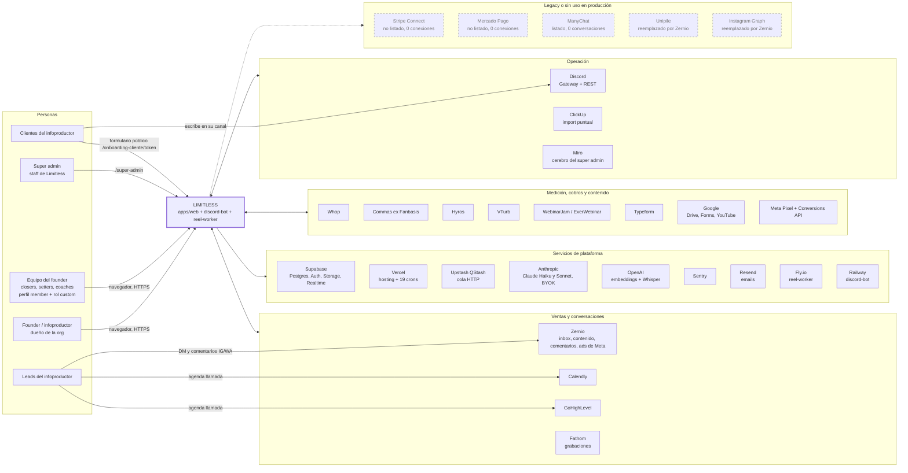
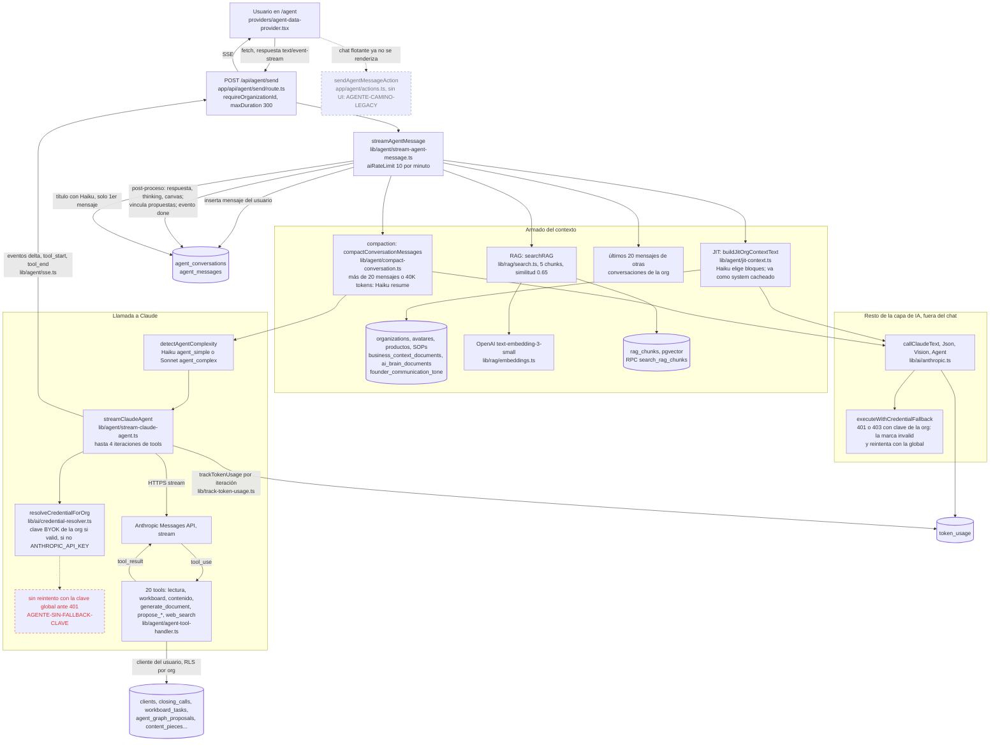
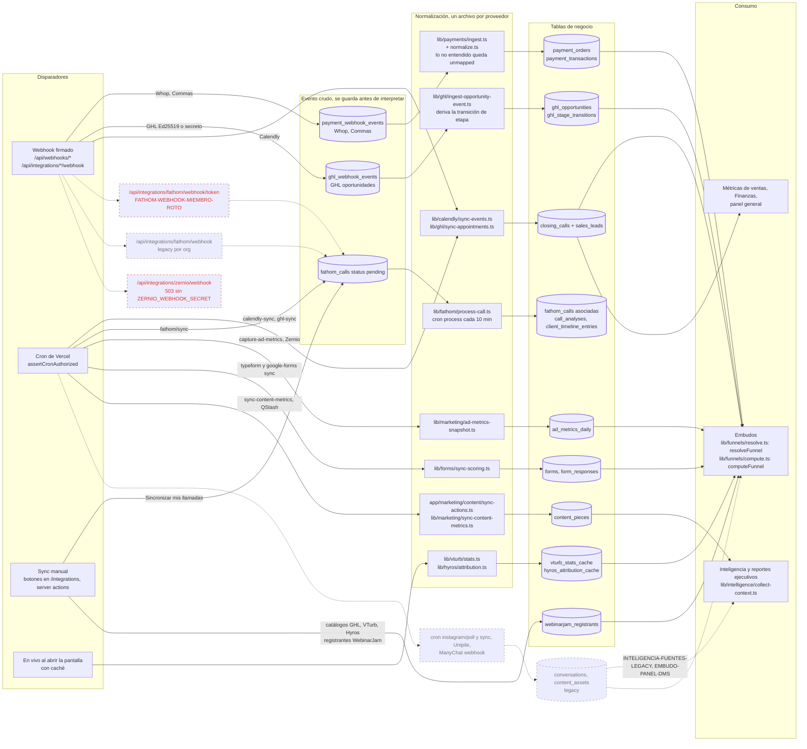
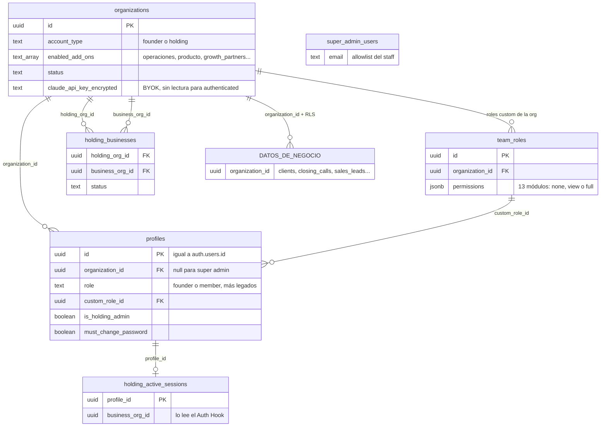
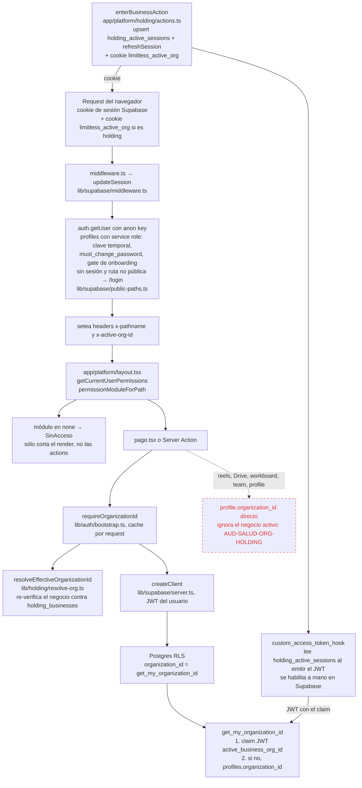

# Diagramas del sistema

> Verificado contra el código el 2026-09-23 (commit `038caca`). Cada nodo que nombra un archivo, una ruta o una
> tabla se comprobó que existe en `apps/`, `supabase/migrations/` o `apps/web/vercel.json`. Los diagramas son
> [Mermaid](https://mermaid.js.org/): GitHub los dibuja solos. Si algo de acá contradice al código, manda el código.

Estos diagramas son el mapa; el detalle está en los documentos hermanos:
[visión general](./vision-general.md) · [auth, organizaciones y permisos](./auth-organizaciones-y-permisos.md) ·
[jobs, webhooks y colas](./jobs-webhooks-y-colas.md) · [base de datos](./base-de-datos.md) ·
[seguridad](./seguridad.md) · [integraciones](../integraciones/README.md).

## Leyenda común

| Cómo se ve | Qué significa |
|---|---|
| Caja y flecha de línea llena | Camino vivo, usado en producción hoy |
| Caja con borde gris punteado y flecha punteada `-.->` | **Legacy o dormido**: el código existe y a veces corre, pero no es el camino vigente o no tiene uso en producción (0 integraciones) |
| Caja con borde rojo punteado | **Roto**: está en el camino pero hoy falla o no deja datos. Lleva el ID de `PENDIENTES.md` en la etiqueta |
| Texto sobre la flecha | Protocolo o transporte (HTTPS, WebSocket, SSE, cola) o qué dispara el paso |

Índice:
1. [Contexto (C4 nivel 1)](#1-contexto-c4-nivel-1)
2. [Contenedores (C4 nivel 2)](#2-contenedores-c4-nivel-2)
3. [Del lead al cliente](#3-flujo-de-datos-principal-del-lead-al-cliente)
4. [Agente de IA](#4-flujo-del-agente-de-ia)
5. [Ingesta de integraciones](#5-flujo-de-ingesta-de-integraciones)
6. [Modelo multi-tenant](#6-modelo-multi-tenant)

---

## 1. Contexto (C4 nivel 1)

**Cómo leerlo.** Limitless es el sistema de gestión del negocio de un infoproductor (el *founder*) y su equipo.
Los clientes finales del founder casi no tocan Limitless: sólo el formulario público de onboarding (add-on
`growth_partners`) y, de forma indirecta, sus mensajes en Discord, que lee el bot. Los leads nunca entran a la
app: escriben por Instagram/WhatsApp (Zernio los muestra en vivo) y agendan en Calendly o GHL. Stripe y
Mercado Pago tienen OAuth y cliente en el código pero nadie los conectó y no se ofrecen en la pantalla; ManyChat,
Unipile e Instagram Graph son el inbox legacy (sus crons y webhooks siguen vivos, ver
`[AUD-SALUD-1]`). Detalle por proveedor: [integraciones](../integraciones/README.md).

---

## 2. Contenedores (C4 nivel 2)

```mermaid
flowchart TB
    classDef legacy stroke-dasharray:5 5,stroke:#888,color:#777
    classDef roto stroke-dasharray:5 5,stroke:#d33,color:#d33

    browser["Navegador<br/>founder, equipo, super admin"]
    publico["Navegador sin sesión<br/>/onboarding-cliente, /prueba"]

    subgraph vercel["Vercel · proyecto otc-plaform · región gru1"]
        direction TB
        mw["middleware.ts<br/>lib/supabase/middleware.ts: updateSession"]
        ui["App Router<br/>Server Components en app/platform, super-admin, founder"]
        actions["Server Actions<br/>app/dominio/actions.ts, 98 archivos use server"]
        api["Route Handlers app/api, 84<br/>webhooks, integrations, queue, discord, rag"]
        sse["POST /api/agent/send<br/>SSE, maxDuration 300"]
        crons["Vercel Cron<br/>19 entradas en vercel.json"]
    end

    subgraph supa["Supabase OTC nrzlylzbmsuowzhpdnjl"]
        pg["Postgres 17 + RLS<br/>get_my_organization_id"]
        auth["Auth<br/>custom_access_token_hook"]
        storage["Storage<br/>buckets trial-reels, client-wins, agent-documents..."]
        realtime["Realtime"]
        vector["pgvector<br/>rag_chunks + RPC search_rag_chunks"]
    end

    qstash["Upstash QStash"]
    reel["apps/reel-worker<br/>Express + FFmpeg · Fly.io otc-reel-worker"]
    bot["apps/discord-bot<br/>discord.js · Railway"]
    discordgw["Discord Gateway y REST"]
    proveedores["Proveedores de negocio<br/>Zernio, Calendly, GHL, Fathom, Whop, Commas..."]
    ia["Anthropic + OpenAI"]
    obs["Sentry + Resend"]
    drive["Google Drive API"]

    browser -->|"HTTPS + cookie de sesión"| mw
    publico -->|"HTTPS, rate limit por IP"| mw
    mw --> ui
    mw --> actions
    browser -->|"fetch, text/event-stream"| sse
    browser <-->|"WebSocket: docs de la KB, jobs de reels y SOP"| realtime
    browser -.->|"WebSocket canal conversations, legacy"| realtime

    ui -->|"HTTPS PostgREST, JWT del usuario"| pg
    actions -->|"createClient: JWT del usuario, RLS"| pg
    actions -->|"createAdminClient: service role, secretos"| pg
    api -->|"service role"| pg
    mw -->|"auth.getUser + profiles con service role"| auth
    sse --> vector
    actions --> storage

    crons -->|"HTTPS GET, Bearer CRON_SECRET"| api
    api -->|"publishCronFanout, publishJSON"| qstash
    actions -->|"publishJSON: RAG, reels"| qstash
    qstash -->|"HTTPS POST /api/queue/*, x-worker-secret o firma"| api
    qstash -->|"HTTPS POST, WORKER_AUTH_SECRET"| reel

    reel -->|"HTTPS descarga del video"| drive
    reel -->|"service role: sube variantes, actualiza reel_variation_jobs"| storage
    reel -->|"Haiku, captions"| ia

    discordgw <-->|"WebSocket Gateway 24/7"| bot
    bot -->|"service role: discord_messages, discord_client_links"| pg
    bot -->|"HTTPS POST /api/discord/testimonial y pending-link, Bearer"| api
    actions -->|"REST con DISCORD_BOT_TOKEN"| discordgw

    proveedores -->|"webhooks HTTPS firmados"| api
    actions <-->|"HTTPS API: sync manual y lecturas en vivo"| proveedores
    api <-->|"HTTPS API: syncs por cron"| proveedores
    actions --> ia
    sse -->|"stream Messages API"| ia
    api --> ia
    vercel --> obs
```

**Cómo leerlo.** Todo el dominio vive en `apps/web`, desplegado en Vercel. Las pantallas y las Server Actions
consultan Postgres con el JWT del usuario (RLS filtra por organización); los webhooks, crons y workers de cola
usan la service role y se autentican solos (firma, `CRON_SECRET`, `WORKER_AUTH_SECRET`). QStash reparte trabajo
largo: fan-out de crons por organización, ingesta RAG, análisis de Fathom, SOP en video y el procesamiento de
reels en Fly. El bot de Discord existe aparte porque necesita un WebSocket abierto 24/7; escribe directo en la
base y avisa a la web por HTTPS. El navegador se suscribe a Realtime para la base de conocimiento, los jobs de
reels y de SOP; el canal de `conversations` que abre `providers/platform-data-provider.tsx` en cada pantalla es
legacy (la tabla tiene 0 filas). Detalle: [visión general](./vision-general.md),
[jobs, webhooks y colas](./jobs-webhooks-y-colas.md), [operación: entorno y deploy](../operacion/entorno-y-deploy.md).

---

## 3. Flujo de datos principal: del lead al cliente

```mermaid
flowchart TD
    classDef legacy stroke-dasharray:5 5,stroke:#888,color:#777
    classDef roto stroke-dasharray:5 5,stroke:#d33,color:#d33
    classDef tabla stroke-width:2px

    subgraph dm["1. Conversación: Zernio, en vivo"]
        zernioApi["Zernio API<br/>DMs y comentarios de IG/WA"]
        inbox["/sales/inbox<br/>app/integrations/zernio/actions.ts"]
        zca[("zernio_conversation_analysis")]:::tabla
        zwh["/api/integrations/zernio/webhook<br/>503 en prod: falta ZERNIO_WEBHOOK_SECRET"]:::roto
        zmsg[("zernio_messages, zernio_comments<br/>zernio_messages sin lector")]:::roto
        legacyInbox["Inbox legacy: ManyChat, Unipile, Instagram Graph"]:::legacy
        conv[("conversations<br/>0 filas")]:::legacy
    end

    zernioApi -->|"lectura en vivo, no se persiste"| inbox
    inbox -->|"análisis IA manual, Haiku"| zca
    zernioApi -.->|"webhook"| zwh
    zwh -.-> zmsg
    legacyInbox -.-> conv

    subgraph turno["2. Turno agendado: aparece el lead"]
        calOrg["Calendly de la org<br/>webhook + cron horario<br/>lib/calendly/sync-events.ts"]
        ghlSync["GoHighLevel<br/>cron /api/cron/ghl-sync<br/>lib/ghl/sync-appointments.ts"]
        calCloser["Calendly de cada closer<br/>lib/calendly/closer-sync.ts<br/>sin lead_id: CALENDLY-CLOSER-SIN-LEAD"]:::roto
        resolve["lib/sales/resolve-lead.ts<br/>identidad = mail, o ghl_contact_id"]
        cc[("closing_calls<br/>un turno = un intento")]:::tabla
        sl[("sales_leads")]:::tabla
    end

    calOrg --> cc
    ghlSync --> cc
    calCloser -.-> cc
    calOrg --> resolve
    ghlSync --> resolve
    resolve --> sl
    sl ---|"closing_calls.lead_id"| cc

    subgraph closing["3. Closing y llamada"]
        seguimiento["/sales/closing, pestaña seguimiento<br/>app/sales/lead-actions.ts<br/>estado del hilo derivado, no guardado"]
        fathomRec["Fathom: grabación de la llamada<br/>cron sync + process cada 10 min"]
        fc[("fathom_calls")]:::tabla
        ca[("call_analyses<br/>sin FK: LLAMADAS-EMBED-ROTO")]:::roto
    end

    cc --> seguimiento
    seguimiento -->|"next_action, calificación, status_source manual"| cc
    fathomRec -->|"lib/fathom/process-call.ts"| fc
    fc -->|"cruce mail invitado con closing_calls.lead_email"| cc
    fc -->|"análisis profundo, QStash"| ca

    subgraph cierre["4. Cierre: markCallClosed en el navegador, no atómico"]
        provider["providers/platform-data-provider.tsx<br/>CLOSING-CIERRE-ATOMICO"]
        upd["updateClosingCallAction<br/>app/closing/actions.ts"]
        create["createClientAction<br/>app/clients/actions.ts"]
        link["linkLeadToClientAction<br/>app/sales/lead-actions.ts"]
        pay["recordClientPaymentAction<br/>app/sales/payment-actions.ts"]
        tagLegacy["tag en conversations, no-op"]:::legacy
    end

    provider --> upd
    upd -->|"status = closed"| cc
    provider -.-> tagLegacy
    provider --> create
    create --> cl[("clients")]:::tabla
    provider --> link
    link -->|"sales_leads.client_id"| sl
    provider -->|"si hay comprobante"| pay
    pay --> cp[("client_payments<br/>+ clients.installments")]:::tabla

    subgraph cobros["5. Cobros y pagos"]
        cobrosUi["/sales/cobros<br/>cuotas a mano con comprobante"]
        whopCommas["Whop y Commas<br/>webhooks /api/webhooks/whop y fanbasis"]
        pt[("payment_orders, payment_transactions<br/>alimentan Embudos, no Cobros ni Finanzas")]:::tabla
    end

    cobrosUi --> cp
    whopCommas --> pt

    subgraph entrega["6. Entrega: recorrido, 1-1 y wins"]
        onb["Onboarding por link, add-on<br/>app/onboarding-cliente/actions.ts"]
        onbT[("client_onboarding_submissions<br/>client_timeline_entries")]:::tabla
        oneOnOne["1-1 por link de Fathom<br/>app/fathom/manual-upload-actions.ts"]
        tasks[("client_tasks")]:::tabla
        botMsg["apps/discord-bot<br/>message-handler.ts"]
        dmsg[("discord_messages")]:::tabla
        signals["cron /api/cron/daily-signals<br/>lib/checkpoints/propose-from-texts.ts, Haiku"]
        prop[("client_checkpoint_proposals")]:::tabla
        record["recordCheckpointAction<br/>app/clients/checkpoint-event-actions.ts"]
        ev[("client_checkpoint_events<br/>+ clients.status, current_stage_id")]:::tabla
        wins["createWinFromTestimonialAction<br/>app/discord/actions.ts + app/clients/win-actions.ts"]
        cw[("client_wins")]:::tabla
    end

    cl --> onb
    onb --> onbT
    oneOnOne -->|"lib/fathom/one-on-one-tasks.ts"| tasks
    oneOnOne --> fc
    botMsg --> dmsg
    dmsg --> signals
    fc -->|"llamadas de entrega"| signals
    signals --> prop
    prop -->|"acceptCheckpointProposalAction"| record
    record --> ev
    dmsg -->|"testimonio"| wins
    wins --> cw
```

**Cómo leerlo.** El DM **no crea un lead**: la bandeja de Zernio se lee en vivo y sólo se guarda el análisis IA
que alguien pide a mano (`zernio_conversation_analysis`). El lead como entidad (`sales_leads`) nace cuando llega
un turno de Calendly o GHL con mail o contacto de GHL; los turnos del Calendly propio de cada closer entran sin
`lead_id` y no aparecen en el seguimiento. El cierre lo encadena el navegador (turno cerrado, cliente, vínculo
lead-cliente, pago): si falla a mitad queda inconsistente. Whop y Commas escriben en tablas que sólo lee Embudos;
Cobros son cuotas cargadas a mano. Después del cierre, el recorrido avanza con hitos registrados a mano o
aceptados desde propuestas que arma el cron diario con Discord y las llamadas de entrega; nada se registra solo.
Detalle: [ventas](../areas/ventas.md), [clientes](../areas/clientes.md),
[recorrido y wins](../areas/clientes-recorrido-y-wins.md), [growth partners](../areas/clientes-growth-partners.md),
[discord](../areas/discord.md), [finanzas](../areas/finanzas.md).

---

## 4. Flujo del agente de IA

**Cómo leerlo.** El chat vivo es SSE: `POST /api/agent/send` abre el stream y `streamAgentMessage` orquesta.
El contexto se arma "justo a tiempo": Haiku elige qué bloques del negocio entran, se suman hasta 5 fragmentos
del RAG (embeddings de OpenAI en `rag_chunks`), mensajes de otras conversaciones de la org y, si la charla es
larga, un resumen hecho por Haiku (la compaction no toca la base, sólo lo que se manda). Claude llama tools que
leen datos con el cliente del usuario (RLS por org, pero sin mirar permisos por módulo). La clave BYOK de la org
se usa si es válida; las llamadas no-stream (`lib/ai/anthropic.ts`) caen a la clave global ante un 401/403, pero
el stream del agente no. El costo de cada llamada queda en `token_usage`; embeddings y la Batch API del
super admin no se registran (`[IA-COSTOS-INCOMPLETOS]`). Detalle: [agente de IA](../areas/agente-ia.md).

---

## 5. Flujo de ingesta de integraciones

**Cómo leerlo.** Hay cuatro formas de que entre un dato: webhook, cron, sync manual y lectura en vivo (VTurb,
Hyros e inbox de Zernio, con caché y sin duplicar en la base salvo `ad_metrics_daily`). Los webhooks nuevos
(Whop, Commas, GHL) guardan el payload crudo antes de interpretarlo, y lo que no se entiende queda `unmapped`,
nunca como cero. Fathom usa `fathom_calls` como cola: el sync la llena y el cron de proceso la vacía. Todo
termina en tablas de negocio que leen Embudos, Métricas e Inteligencia. En rojo: el webhook de Fathom por
miembro no puede guardar (columnas equivocadas) y el de Zernio responde 503 en producción. En gris: el inbox
legacy sigue corriendo y alimentando `conversations` (0 filas), que todavía leen inteligencia, el panel y los
bindings por defecto del embudo DM. Detalle: [integraciones](../integraciones/README.md),
[embudos](../areas/embudos.md), [jobs, webhooks y colas](./jobs-webhooks-y-colas.md),
[APIs sin documentación](../integraciones/apis-sin-documentacion.md).

---

## 6. Modelo multi-tenant

### 6a. Entidades

**Cómo leerlo.** La organización es la raíz: un usuario tiene un solo perfil atado a una sola org
(`profiles.organization_id`), y todas las tablas de negocio llevan `organization_id`. Una org `holding` agrupa
negocios en `holding_businesses`; el negocio que el usuario está mirando se guarda en `holding_active_sessions`.
Los roles custom (`team_roles.permissions`) sólo deciden qué pantallas se dibujan: **ninguna policy de RLS mira
el rol** (`[PERMISOS-SERVER-ACTIONS]`). El super admin no tiene org; entra por la allowlist `super_admin_users`.
`team_invitations` sigue en la base pero ningún código crea filas (invitar crea la cuenta directo).

### 6b. Resolución de la org efectiva por request

**Cómo leerlo.** Hay **dos mecanismos que tienen que coincidir** para un holding: la app sabe qué negocio mira
por la cookie `limitless_active_org` (la re-verifica `requireOrganizationId` contra `holding_businesses` en cada
request) y la base lo sabe por el claim `active_business_org_id` del JWT, que agrega el Auth Hook al refrescar la
sesión. Para una org común los dos caen en `profiles.organization_id`. El bloqueo por módulo del layout sólo
esconde pantallas; las Server Actions no lo repiten salvo guards puntuales (founder, add-on, super admin). En
rojo: las acciones que leen `profile.organization_id` en vez de `requireOrganizationId()` ignoran el negocio
activo del holding. Nota: la carpeta real es `app/(platform)/`; Mermaid no admite paréntesis sin comillas en
algunos renderizadores, por eso figura como `app/platform`. Detalle:
[auth, organizaciones y permisos](./auth-organizaciones-y-permisos.md), [seguridad](./seguridad.md),
[base de datos](./base-de-datos.md).
