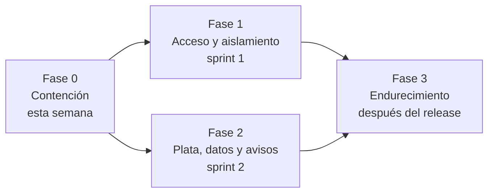

# Plan de remediación

| | |
|---|---|
| **Qué es** | El orden sugerido para resolver los hallazgos de la auditoría, por fases y con sus dependencias |
| **Fecha** | 2026-09-23 |
| **Base** | [`PENDIENTES.md`](../../PENDIENTES.md) (13 P0 y 92 P1, todos con severidad, riesgo, impacto y criterio de aceptación) y los informes de [`docs/auditoria/`](./README.md) |
| **Estado** | **Propuesta**. Las prioridades y las fechas las deciden Agustín (producto) y Fernando (Scrum Master) en la planificación; acá no se estima esfuerzo |

## Cómo se armó

La prioridad (P0–P3) dice qué tan urgente es cada ítem por separado. El plan agrega dos criterios:

1. **Dependencias.** Algunos arreglos habilitan o hacen seguros a otros. El caso más claro: **no se debería
   aplicar ninguna migración de arreglo sin un backup de la base**, y hoy no hay backups.
2. **Costo de oportunidad.** Varios hallazgos críticos se resuelven cambiando una configuración o con una
   migración de pocas líneas. Van primero porque el riesgo es alto y el trabajo, chico.

Cada fase cierra con los **criterios de aceptación** de sus ítems en `PENDIENTES.md`: no hay "hecho" sin eso.

## Fase 0 — Contención (esta semana, antes de cualquier otro cambio)

Casi todo es configuración o una migración de pocas líneas. El objetivo es cerrar lo que hoy se puede explotar
o perder, sin esperar a un sprint.

| # | Qué | Ítem | Sev. | Por qué primero |
|---|---|---|---|---|
| 0.1 | Hacer **hoy** un dump completo de la base y una copia de Storage, guardados fuera de Supabase. Decidir el plan de Supabase (Pro trae backups diarios) | `[DR-BACKUPS-SUPABASE]`, `[SUPABASE-PLAN-FREE-LIMITES]` | Crítica | Todo lo demás implica migraciones. Sin backup, un error al arreglar es irrecuperable |
| 0.2 | Confirmar que `ENCRYPTION_MASTER_KEY` tiene una copia fuera de Vercel, con acceso de dos personas | `[SEC-MASTER-KEY-ROTACION]` | Crítica | Si se pierde, dejan de funcionar todas las integraciones cifradas y los cobros de Commas se pierden |
| 0.3 | Quitarle a `authenticated`/`anon` los permisos de escritura sobre la vista `organization_claude_status` y marcarla `security_invoker` | `[DB-VISTA-CLAUDE-STATUS-ESCRIBIBLE]` | Crítica | Hoy cualquier miembro puede borrar su organización entera con una llamada, y no hay backup |
| 0.4 | Borrar las policies del bucket `import-files` (y el bucket, después de respaldar sus 2 archivos) | `[SEG-BUCKET-IMPORT-FILES]` | Crítica | Cualquier usuario logueado lee y borra esos archivos |
| 0.5 | Rotar `WORKER_AUTH_SECRET` (quedó en URLs y logs) | `[TRIAL-SECRET-EN-URL]` | Crítica | Con el secreto viejo se pueden leer archivos de otras orgs a través del worker |
| 0.6 | Decidir si `ZERNIO_API_KEY` tiene que estar en Production; si no, sacarla | `[ZERNIO-KEY-GLOBAL]` | Crítica | Las orgs sin Zernio ven datos de la cuenta global |
| 0.7 | Cargar o confirmar `ANTHROPIC_API_KEY` en Vercel | `[ENV-ANTHROPIC-VERCEL]`, `[1A1-CLAVE-ANTHROPIC-ROTA]` | Alta | ~3.000 fallas de IA en 7 días por clave inválida sin fallback |
| 0.8 | Activar reglas de alerta en Sentry (error nuevo, pico) hacia un canal del equipo | parte de `[OBS-SIN-ALERTAS]` | Alta | Hoy nadie se entera de las fallas; es configuración, no código |

**Criterio de salida de la fase 0:** existe un backup restaurable y documentado, las cuatro vías de ataque
de 0.3–0.6 están cerradas (verificadas con los criterios de aceptación de sus ítems) y llega al menos una alerta real.

## Fase 1 — Acceso y aislamiento (sprint 1)

El orden dentro de la fase importa: el helper de permisos es la base de todos los ítems `PERMISOS-*` de cada área.

| # | Qué | Ítems | Sev. | Depende de |
|---|---|---|---|---|
| 1.1 | Firmar el estado de OAuth (HMAC) y exigir que la org de la cookie coincida con la de la sesión, en un helper común para los 10 callbacks | `[OAUTH-ESTADO-SIN-FIRMA]` | Crítica | — |
| 1.2 | Cortar el acceso de un miembro desactivado (middleware + revocar sesiones) | `[EQUIPO-DESACTIVAR-NO-BLOQUEA]` | Crítica | — |
| 1.3 | Helper `requireModuleAccess` y policies de escritura por rol en `team_roles`, `team_invitations`, `organizations`; aplicarlo primero en plata, equipo, BYOK e integraciones | `[PERMISOS-SERVER-ACTIONS]`, `[PERMISOS-SERVER-ACTIONS/infra]` | Alta | 0.1 (migración) |
| 1.4 | Extender el helper a cada área | `[PERMISOS-SERVER-ACTIONS/clientes]`, `/ventas`, `/marketing`, `/agente-ia`, `/ops-fin-prod`, `[PERMISOS-LAYOUT-NAV-SUAVE]` | Alta | 1.3 |
| 1.5 | Holding: exigir el rol en las policies de portfolio y en las acciones con service role; revalidar el claim | `[HOLDING-PORTFOLIO-ROL]`, `[DB-CLAIM-HOLDING-SIN-REVALIDAR]` | Crítica | 0.1 |
| 1.6 | Que el usuario no pueda escribir identificadores de cuentas externas ni rutas de Storage; re-validar el prefijo de org antes de firmar, bajar o borrar | `[SEG-RLS-IDENTIFICADORES-EXTERNOS]`, `[STORAGE-RUTA-DESDE-FILA]` | Crítica | 0.1 |
| 1.7 | Validar el cliente contra la org al asociar una llamada de Fathom | `[FATHOM-CLIENTID-SIN-VALIDAR]` | Crítica | — |
| 1.8 | Worker de Fly: secreto en header, cruzar org y ruta del payload contra el job | `[SEG-REEL-WORKER-AUTH]` | Crítica | 0.5 |
| 1.9 | Arreglos cortos de autenticación | `[AUTH-CALLBACK-NEXT]`, `[AUTH-RECUPERAR-PASSWORD]` | Media | — |
| 1.10 | Decidir y cerrar el alta de cuentas | `[SIGNUP-PUBLICO]`, `[AUTH-ALTA-EMAIL-AJENO]` | Crítica | Decisión de Agustín |

**Criterio de salida:** con un usuario de sólo lectura y con uno de otra organización, los criterios de aceptación de
1.1–1.8 pasan; el bloque de permisos de [`verificacion-manual.md`](../operacion/verificacion-manual.md) está corrido.

## Fase 2 — Plata, datos y avisos (sprint 2, hasta el release)

| # | Qué | Ítems | Sev. |
|---|---|---|---|
| 2.1 | Ingesta de pagos: responder 5xx si no se guardó, no descartar reintentos legítimos, idempotencia en el registro de pagos | `[EMBUDOS-WEBHOOK-PERDIDA]`, `[AUD-CONF-5]`, `[PAGO-SIN-IDEMPOTENCIA]` | Crítica |
| 2.2 | Cierre de venta en una sola transacción en el servidor | `[CLOSING-CIERRE-ATOMICO]` | Crítica |
| 2.3 | Closing con más de 1.000 turnos (medir primero cuántas orgs lo pasan) | `[CLOSING-LIST-1000]` | Alta |
| 2.4 | Llamadas y Fathom: pantalla de Llamadas, webhook por miembro, cursor de la sync | `[LLAMADAS-EMBED-ROTO]`, `[FATHOM-WEBHOOK-MIEMBRO-ROTO]`, `[FATHOM-SYNC-CURSOR]` | Alta |
| 2.5 | Formularios que pierden respuestas o se pisan entre orgs | `[AUDITORIA-ABIERTOS §6]`, `[AUD-CONF-4]` | Crítica |
| 2.6 | Saber cuándo algo falla: errores por org a Sentry, monitores de crons, integraciones con token vencido marcadas | `[OBS-SIN-ALERTAS]`, `[MONITOREO-Y-ALERTAS]`, `[INTEGRACIONES-ERROR-SIN-MARCA]` | Alta |
| 2.7 | Lo que Agustín marque "Sí" en la columna Octubre de [`FUNCIONAL.md`](../FUNCIONAL.md) | según su marca | — |

## Fase 3 — Endurecimiento (después del release)

- Secretos: cifrar los tokens OAuth guardados en texto plano (`[AUD-SEG-2]`), soportar la rotación de la master key
  (`[SEC-MASTER-KEY-ROTACION]`, parte de código), sacar la service role completa del bot y del worker
  (`[SERVICE-ROLE-FUERA-DE-VERCEL]`), limpiar datos personales de los logs (`[LOGS-DATOS-SENSIBLES]`).
- Identidad: MFA al menos para founders y super admin, y protección contra contraseñas filtradas (`[AUTH-MFA-Y-POLITICA]`).
- Entorno de prueba separado de producción (`[ENTORNO-STAGING]`).
- El resto de los P1 por área y los P2, en el orden que salga de la planificación.
- **Auditorías que quedaron sin hacer** (ver [`README.md`](./README.md) § Alcance): calidad de código, rendimiento
  y costos por cliente.

## Decisiones que bloquean trabajo

Sin estas decisiones, los ítems quedan parados. Todas son de negocio, no técnicas:

| Decisión | Ítems | Quién |
|---|---|---|
| Plan de Supabase (Free → Pro) y dónde guardar los dumps | `[DR-BACKUPS-SUPABASE]`, `[SUPABASE-PLAN-FREE-LIMITES]` | Agustín |
| ¿El alta de cuentas es pública o sólo por invitación? | `[SIGNUP-PUBLICO]`, `[AUTH-ALTA-EMAIL-AJENO]` | Agustín |
| ¿Hace falta la key global de Zernio en producción? | `[ZERNIO-KEY-GLOBAL]` | Agustín |
| Quién recibe las alertas y por qué canal | `[OBS-SIN-ALERTAS]`, [`../operacion/incidentes.md`](../operacion/incidentes.md) | Equipo |
| Objetivos de pérdida máxima de datos (RPO) y tiempo de recuperación (RTO) | [`backups-y-recuperacion.md`](./backups-y-recuperacion.md) | Agustín y Fernando |
| Las 7 decisiones de negocio P1 del backlog | ver [`../ESTADO_PARA_EQUIPO.md`](../ESTADO_PARA_EQUIPO.md) | Agustín |
| Ajustes de prioridad que sugiere la severidad | ver [`README.md`](./README.md) § Prioridades a revisar | Agustín y Fernando |
